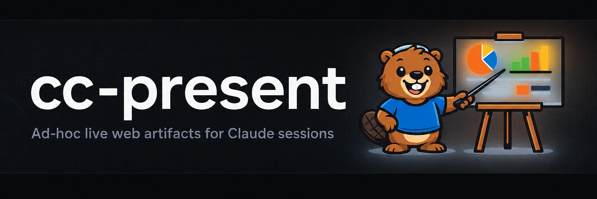

# cc-present



[](https://github.com/yasyf/cc-present/releases)
[](https://github.com/yasyf/cc-present/actions/workflows/ci.yml)
[](https://github.com/yasyf/cc-present/blob/main/LICENSE)

Ad-hoc live web artifacts for Claude sessions — approval boards, choices, and rich content whose every click streams back to the agent.

cc-present turns "here's a static page, reply in chat" into a live loop. A Claude session composes a web page out of typed blocks (approval cards, choices, feedback boxes, code, diffs, tables) and serves it at a localhost URL; every button you click streams back into the session as a typed event, and the agent patches individual blocks in your open tab without a reload.

## Install

Homebrew (macOS):

```bash
brew install yasyf/tap/cc-present
```

Or with the Go toolchain:

```bash
go install github.com/yasyf/cc-present/cmd/cc-present@latest
```

Both paths go live with the first tagged release. Until then, build from a clone: `task build` compiles the SPA and then the binary into `./bin/cc-present` (`go:embed` bakes the SPA into the binary, so the order is load-bearing).

## Quickstart

Write a document of blocks, start it, and watch interactions stream back. From a clone:

```bash
task build
cat > board.json <<'EOF'
{
  "version": 1,
  "title": "Pick an opener",
  "submit": { "label": "Send decisions" },
  "blocks": [
    { "id": "opener", "type": "card", "title": "README opener", "children": [
      { "id": "pick", "type": "choice", "options": [
        { "id": "a", "label": "A", "md": "**Review Claude's diffs like a PR.**" },
        { "id": "b", "label": "B", "md": "**A PR-style review UI for agent edits.**" }
      ] },
      { "id": "verdict", "type": "approval", "prompt": "Ship the selected opener?" }
    ] }
  ]
}
EOF
./bin/cc-present start --session demo --cwd "$PWD" --doc board.json
# session: 969500fae670b596f48dffd8b9859142
# url: http://127.0.0.1:55339/p/pick-an-opener--5b817e15
# channel: inactive
./bin/cc-present watch --session demo --cwd "$PWD"
# {"blockId":"pick","optionIds":["a"]}
# {"blockId":"verdict","verdict":"approved"}
# {"revision":1}
```

Open the URL; picking option A, approving, and pressing Submit produces exactly the three lines shown — `watch` prints one JSON payload per human interaction as it happens (`channel: inactive` just means no MCP channel is attached; the plugin wires that). When the round is done, collect the reduced state and shut down:

```bash
./bin/cc-present outcomes --session demo --cwd "$PWD"   # reduced doc + human interactions as JSON
./bin/cc-present close --session demo --cwd "$PWD"
# closed: pick-an-opener--5b817e15
./bin/cc-present stop
# daemon: stopping
```

Inside a Claude Code session the plugin does this wiring for you — install it and say "present this as an approval board":

```
/plugin marketplace add yasyf/cc-present
/plugin install cc-present@cc-present
```

The plugin adds the cc-present MCP channel (human clicks arrive in the session as `<channel source="cc-present">` tags), a SessionStart hook that installs the binary and records the session, and the `/cc-present:present` skill that drives the loop: start, watch, reply, outcomes.

## How it works

A lazy per-user daemon (`~/.cc-present`) owns one append-only event log per artifact and serves the SPA, a REST endpoint for interactions, and an SSE stream on a localhost port; the CLI is a thin client over its unix socket. The log has two lanes: the agent writes the document lane (`doc.replaced`, `block.upserted`, `block.removed`, `reply.created`, `present.closed`) and the human writes the interaction lane (`decision.created`, `choice.selected`, `feedback.created`, `input.submitted`, `submit`). State is a pure reduction of that log — a fresh tab replays it from seq 0 over SSE, so there is no get-document endpoint, and an agent re-upserting a block never clobbers your verdict. `watch` excludes the agent's own origin, so the agent hears the human lane only.

The document is a flat list of typed blocks (a `card` nests leaf blocks one level deep):

| Block | Renders | A click emits |
|---|---|---|
| `section` | a header with optional prose | — |
| `card` | a titled container with chips and a status, nesting leaf blocks | — |
| `approval` | approve/reject controls, plus a feedback box when allowed | `decision.created`, `feedback.created` |
| `choice` | a single- or multi-select set of options | `choice.selected` |
| `input` | a free-text field | `input.submitted` |
| `markdown` | prose, optionally struck through | — |
| `code` | a highlighted snippet | — |
| `diff` | a unified diff | — |
| `image` | an image with a caption | — |
| `table` | aligned columns of inline-markdown cells | — |
| `progress` | a labeled meter | — |

The document-level Submit button emits `submit`. The full wire contract — block fields, validation rules, event payloads, and the REST surface — is [docs/contract.md](docs/contract.md); [`plugin/skills/present`](plugin/skills/present/SKILL.md) is the skill that drives the loop from inside a session. A complete sample document lives in [`examples/opener-board.json`](examples/opener-board.json).

## What problems does this solve?

- **Static artifacts collect decisions out-of-band.** An agent that drafts 26 README openers as an HTML page still needs you to type "card 14, option B" back into chat. Here every card carries its own approve/reject/feedback controls, and each click arrives in the session as a typed event.
- **Approval state gets lost between rounds.** The document is a pure reduction of an append-only event log. Agent content and human decisions live in separate lanes of that log, so a redrafted card keeps your earlier verdicts intact.
- **One-shot UIs go stale mid-conversation.** The agent patches single blocks over the same stream your browser is subscribed to. A rejected opener becomes a redraft in your open tab, no reload.
- **Bespoke review UIs take a repo each.** Blocks compose (markdown, cards, choices, inputs, code, diffs, images, tables, progress), so one JSON document covers an approval board today and a triage dashboard tomorrow.

Everything else — per-command flags, the daemon lifecycle, the channel — is in `cc-present --help`.
