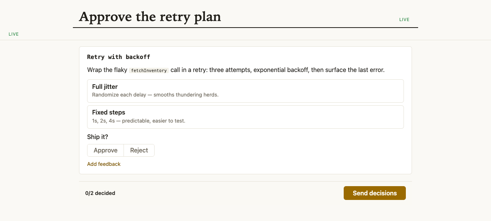

# 

**Approval boards where every click streams back to the agent.** A Claude session serves a page of typed blocks — approvals, choices, diffs — at a localhost URL and reacts to each click in your open tab, no reload.

[](https://github.com/yasyf/cc-present/releases)
[](https://github.com/yasyf/cc-present/actions/workflows/ci.yml)
[](https://github.com/yasyf/cc-present/blob/main/LICENSE)

## Get started

One round takes about two minutes end to end. Install, serve the sample board, click, and collect the decisions.

```bash
brew install yasyf/tap/cc-present
curl -fsSLO https://raw.githubusercontent.com/yasyf/cc-present/main/examples/quickstart-board.json
cc-present start --session demo --cwd "$PWD" --doc quickstart-board.json
# session: <session id>
# url: http://127.0.0.1:<port>/p/approve-the-retry-plan--<hash>
# channel: inactive
cc-present watch --session demo --cwd "$PWD"
```



Open the URL, pick "Full jitter", approve, and press Send decisions. `channel: inactive` means no Claude session is attached; the Claude plugin wires that. `watch` prints one self-describing JSON payload per interaction as it happens:

```text
{"blockId":"strategy","optionIds":["jitter"],"type":"choice.selected"}
{"blockId":"verdict","type":"decision.created","verdict":"approved"}
{"revision":1,"type":"submit"}
```

Collect the round and shut down. On close, `watch` prints `{"type":"present.closed"}` and exits:

```bash
cc-present outcomes --session demo --cwd "$PWD"   # reduced doc + human interactions as JSON
cc-present close --session demo --cwd "$PWD"
# closed: approve-the-retry-plan--<hash>
cc-present stop
# daemon: stopping
```

Driving with an agent? Paste this:

```text
/plugin marketplace add yasyf/cc-present
/plugin install cc-present@cc-present
```

The plugin auto-installs the binary and wires the loop: an MCP channel that delivers clicks into the session as `<channel source="cc-present">` tags, a SessionStart hook, and the `/cc-present:present` skill that drives compose, watch, reply, and outcomes.

---

## Use cases

### Collect verdicts on ten drafts without "card 14, option B"

A static review page still makes you type decisions back into chat. On a board, every card carries its own approve/reject/feedback controls, and each click lands in the session as one typed event:

```text
{"blockId":"verdict","type":"decision.created","verdict":"approved"}
```

### Redraft a rejected card without losing the other verdicts

A regenerated one-shot page forgets what you already decided. The agent patches single blocks over the stream your tab is subscribed to, so a rejected draft becomes a redraft in place — and your earlier verdicts survive, because agent content and human decisions live in separate lanes of the event log.

### Cover tomorrow's dashboard with today's JSON

A bespoke review UI takes a repo each. Blocks compose — markdown, cards, choices, inputs, code, diffs, images, tables, progress — so the document that renders an approval board today renders a triage dashboard tomorrow. The full vocabulary is in the table below.

## Blocks

The document is a flat list of typed blocks (a `card` nests leaf blocks one level deep), and the document-level Submit button emits `submit`:

| Block | Renders | A click emits |
|---|---|---|
| `section` | a header with optional prose | — |
| `card` | a titled container with chips and a status, nesting leaf blocks | — |
| `approval` | approve/reject controls, plus a feedback box when allowed | `decision.created`, `feedback.created` |
| `choice` | a single- or multi-select set of options | `choice.selected` |
| `input` | a free-text field | `input.submitted` |
| `markdown` | prose, optionally struck through | — |
| `code` | a highlighted snippet | — |
| `diff` | a unified diff | — |
| `image` | an image with a caption | — |
| `table` | aligned columns of inline-markdown cells | — |
| `progress` | a labeled meter | — |

A complete sample document lives in [`examples/opener-board.json`](examples/opener-board.json). The wire contract — block fields, validation rules, event payloads, the REST surface — is [docs/contract.md](docs/contract.md), and the [present skill](plugin/skills/present/SKILL.md) drives the loop from inside a session.

Under the hood, a per-user daemon owns one append-only event log per artifact: the agent writes one lane, the human writes the other, and the page is a pure reduction of the log — a fresh tab replays it over SSE, and an agent redraft never clobbers your verdict.

Everything else — per-command flags, the daemon lifecycle, the channel — is in `cc-present --help`. Licensed under [PolyForm Noncommercial 1.0.0](LICENSE).
